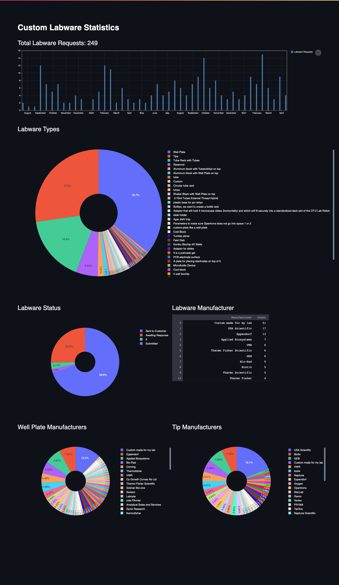

<!-- ABOUT THE PROJECT -->
# Custom Labware Stats


This creates a dashboard using the Streamlit framework and Google Sheets API to display labware requests data. 

### Built With

* [Streamlit](https://streamlit.io/)
* [Pandas](https://pandas.pydata.org/)

<!-- GETTING STARTED -->
## Getting Started

### Prerequisites

* Create a virtual environment
  ```sh
  python3 -m venv env
  ```
* Activate virtual environment
  ```sh
  source env/bin/activate
  ```
* Acquire an API key (OAuth 2.0 Method) [here](https://console.cloud.google.com/apis/credentials) ([Further Reference](https://developers.google.com/sheets/api/guides/authorizing))
* Once you create your key you should have a `credentials.json` file (you may need to rename it).

### Installation

1. Clone the repo
   ```sh
   git clone https://github.com/sakibh/custom-labware-stats.git
   ```
2. Install Python packages (ensure virtual environment is activated)
   ```sh
   pip install -r requirements.txt
   ```
3. Add your `credentials.json` file to the root directory of the project

4. Create a new file in the root directory called `secret.py` with the following:
   ```py
   sheets_id = 'YOUR_SHEET_ID'
   ```


<!-- USAGE EXAMPLES -->
## Usage

Launch Streamlit Environment:
```sh
streamlit run labware_stats.py
```

_For more examples, please refer to the [Streamlit Documentation](https://docs.streamlit.io/en/stable/)_
